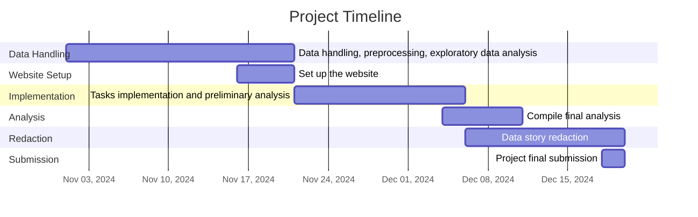

# The YouTube Heavyweights: Entertainment vs. Music Face Off

## Abstract

Some claim the greatest 21st-century showdown was Floyd Mayweather versus Logan Paul, packed with stakes in marketing, money, and public hype. We couldn’t disagree more: the real battle is Entertainment vs. Music on YouTube! Leveraging the YouNiverse dataset, a massive collection of metadata covering 136k channels, 72.9M videos, and 2.8 years of time series data on views and subscribers, we dive into YouTube’s top two categories, analyzing their reach through views, subscriber counts, and strategic collaborations. Do entertainment creators ramp up content in December to maximize ad revenue? Do music artists dominate the long game thanks to loyal fan bases? From seasonal trends to community dynamics, we’ll explore how these giants shape and reshape their audiences. Get ready for a data showdown where each side fights for the throne of influence, popularity, and engagement. Through time series analysis, hypothetical monetization, collaboration statistics, consistency of popularity and diversity, this is YouTube’s ultimate battle—where only one category can claim the crown in the world’s biggest digital arena!

## Research Questions and Methods
With this project, we aim to answer the following research questions (rephrased to identify a clear winner for each question). After each question, we detail the different methods we plan to use:

1. **Which category captures greater monetization potential, and does either Entertainment or Music benefit more from ad-friendly periods?**
   - After gathering information from [Google Support](https://support.google.com/youtube?sjid=13108256786547781650-EU#topic=9257498), we quantify monetization potential ($\text{MP}$) by creating a metric defined as

     $$\text{MP}(\text{video})= CPM\cdot \text{round}\left(\frac{N_{\text{views}}}{1000}\right)\cdot\left[ 1+\alpha\cdot \text{round}\left(  \frac{t_{\text{video}} \text{ [min]}}{8\text{ [min]}}  \right)  \right],$$ 


     where $CPM$ represents the earnings associated with a specific category per thousand views, $N_{\text{views}}$ is the number of views of the video, $t_{\text{video}}$ is the video duration in minutes, $\alpha$ is a scaling factor (set to 0.5 for now), and $\text{round}(\cdot)$ rounds its argument to the nearest integer. The larger the value of $\alpha$, the more influence video duration has on monetization potential. We will compare this metric across the full dataset and during key periods, hypothesizing that Entertainment may experience higher traffic peaks during holiday seasons, while Music might maintain steady viewership through consistent fan support.

2. **Do collaboration patterns in Music or Entertainment channels yield greater viewership, and which category leverages collaborations more effectively to expand reach?**
   - Using text mining on video titles, descriptions and tags, we can identify collaborations (keywords like ‘feat’, ‘ft’, ‘with’, ‘w/’) and measure their impact on viewership and reach. We can then compare the dominance and success of collaborations within each category to assess which leverages partnerships in the most effective way.
   
3. **Which category, Music or Entertainment, maintains more consistent popularity over both short-term and long-term timeframes, and which one performs better in sustaining viewer interest?**
   - We measure short-term versus long-term popularity by setting different time frames (e.g. 24h, 1 week, 1 month, 6 month, 1 year) on the time-series data. By analyzing view trends over time, we identify whether Music or Entertainment videos sustain interest longer, and we classify outliers, like channels with high views but low subscribers, to determine the loyalty differences.
  
4. **Which category, Entertainment or Music, offers a broader diversity of content types and formats?**
   - We will categorize video formats and themes within each category using a machine learning approach, such as keyword clustering with tools like k-Means, in order to come up with a metric to quantify diversity.


### Remarks about Data Preparation and Cleaning
- We begin by filtering the YouNiverse dataset to include only channels and videos within Entertainment and Music categories.
- Essential metadata such as view counts, publications dates, and content/collaboration indicators (e.g. title, tags and descriptions) among others are extracted. We drop irrelevant data (for instance crawl date) to facilitate processing given the dataset’s large disk space requirements.
- Time-series data are organized in the same manner to capture trends across the  dataset’s 2.8-year span, useful to capture seasonal patterns and viewership fluctuations. In addition, basic statistics about both categories will be given, such as time-series of total view and subscriber counts. 

## Proposed timeline and Organization within the Team


| **Task**| **Research Question**| **Description**| **Assigned Member** |
|:--:|:--:|--|:--:|
| **Define Monetization Metric (MP)**| 1 | Develop and calculate the monetization potential metric | Timothée |
| **Identify and Analyze Collaboration Patterns**| 2 | Extract keywords in titles/descriptions to identify collaborations | Sylvain |
| **Short-term vs Long-term Popularity Trends** | 3 | Analyze time-series data to assess short-term vs. long-term interest. Define a loyalty metric and examine it | Max |
| **Categorize Video Types and Formats**| 4 | Use keyword clustering to categorize formats within each category using TF-IDF method | Jérémy |

---

# Quickstart

Follow these steps to set up and run the project locally.

### 1. Clone the Repository

Clone the project repository and navigate into the project directory:

```bash
git clone git@github.com:epfl-ada/ada-2024-project-tropicaltoucansinsight.git
cd ada-2024-project-tropicaltoucansinsight
```

### 2. Set Up the Conda Environment

Install the environment depending on your operating system:

- **For Windows**:
  ```bash
  conda env create -f environments/windows_env.yml
  ```

- **For macOS**:
  ```bash
  conda env create -f environments/mac_env.yml
  ```

### 3. Activate the Environment

Once the environment is created, activate it:

```bash
conda activate tropicaltoucansinsight
```

That's it, you’re all set!


## Project Structure

The directory structure of new project looks like this:

```
├── data                        <- Project data files
│
├── environments                <- Environment files
│
├── experiments                 <- Notebooks for tests
│
├── figures                 	<- Figures folder
│   ├── pdf                     <- Visualizations in pdf format
│   └── pickle			<- Visualizations in pickle format
│
├── resources                   <- Resource folder  
│
├── src                         <- Source code
│   └── utils                   <- Utility directory
│
├── static                      <- Static for website
│
├── .gitignore                  <- List of files ignored by git
│
├── README.md		        <- Repository readme file
│
├── app.py                      <- Python script for the website
│
└── results.ipynb               <- Notebook of results
```
