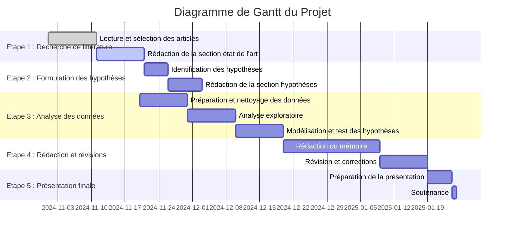
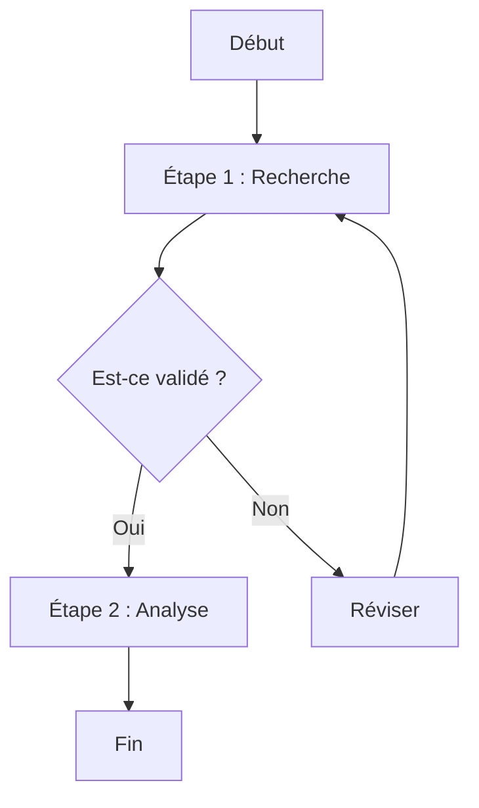

# Your project name
This is a template repo for your project to help you organise and document your code better. 
Please use this structure for your project and document the installation, usage and structure as below.

## Quickstart

```bash
# clone project
git clone <project link>
cd <project repo>

# [OPTIONAL] create conda environment
conda create -n <env_name> python=3.11 or ...
conda activate <env_name>


# install requirements
pip install -r pip_requirements.txt
```


### How to use the library
Tell us how the code is arranged, any explanations goes here.


## Project Structure

The directory structure of new project looks like this:

```
├── data                        <- Project data files
│
├── src                         <- Source code
│   ├── data                            <- Data directory
│   ├── models                          <- Model directory
│   ├── utils                           <- Utility directory
│   ├── scripts                         <- Shell scripts
│
├── tests                       <- Tests of any kind
│
├── results.ipynb               <- a well-structured notebook showing the results
│
├── .gitignore                  <- List of files ignored by git
├── pip_requirements.txt        <- File for installing python dependencies
└── README.md
```

---

File containing the detailed project proposal (up to 1000 words)
- Title
- Abstract: A 150 word description of the project idea and goals. What’s the motivation behind your project? What story would you like to tell, and why?
- Research Questions: A list of research questions you would like to address during the project.
- Proposed additional datasets (if any): List the additional dataset(s) you want to use (if any), and some ideas on how you expect to get, manage, process, and enrich it/them. Show us that you’ve read the docs and some examples, and that you have a clear idea on what to expect. Discuss data size and format if relevant. It is your responsibility to check that what you propose is feasible.
- Methods
- Proposed timeline
- Organization within the team: A list of internal milestones up until project Milestone P3.
- Questions for TAs (optional): Add here any questions you have for us related to the proposed project.

# Plan de projet (test)

Voici le diagramme de Gantt pour le projet :




# Flowchart test


